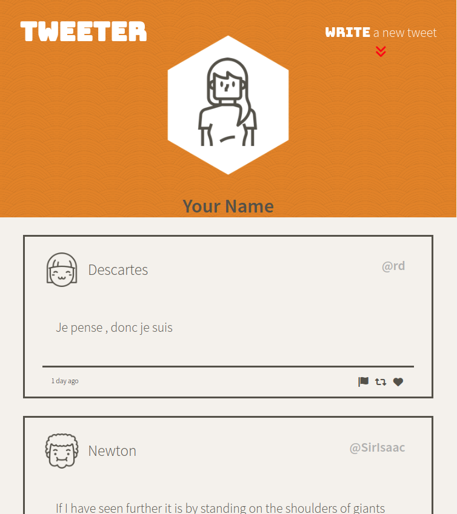
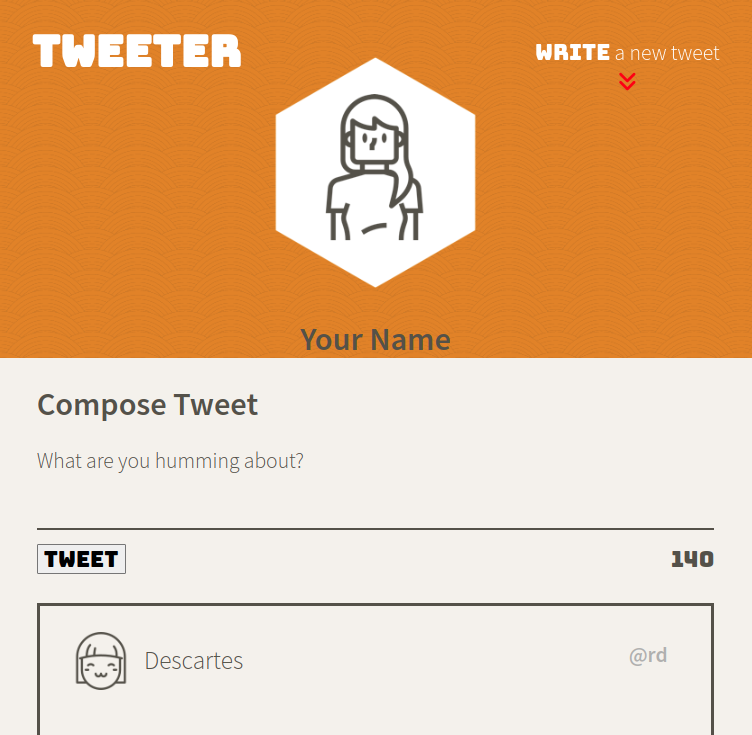
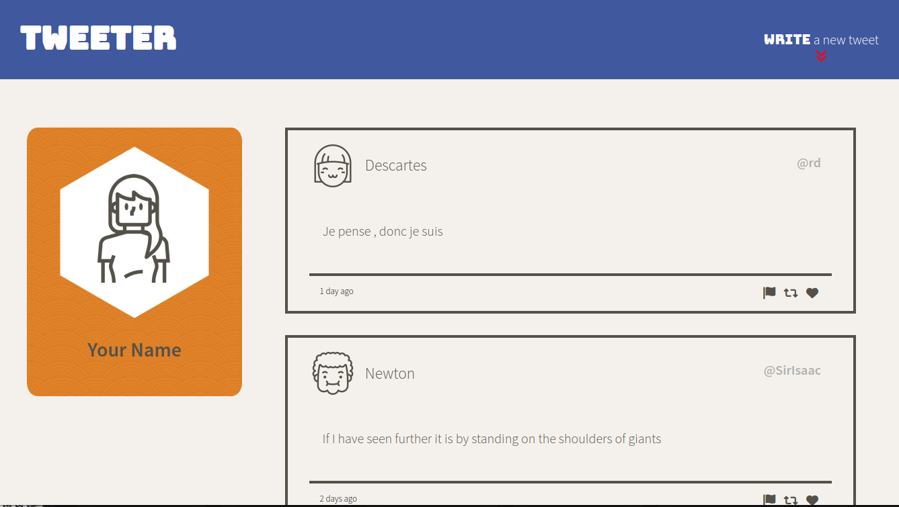

# Tweeter Project

Tweeter is a simple, single-page Twitter clone.

This repository is the starter code for the project: Students will fork and clone this repository, then build upon it to practice their HTML, CSS, JS, jQuery and AJAX front-end skills, and their Node, Express back-end skills.

## Final Product

### Mobile Page


### Compose Form


### Desktop Page


## Dependencies

- [Express](https://www.npmjs.com/package/express)
- [Node](https://docs.npmjs.com/downloading-and-installing-node-js-and-npm#overview) 5.10.x or above
- [body-parser](https://www.npmjs.com/package/body-parser)
- [chance](https://chancejs.com/)

## Getting Started

In order to run this application, you will need to have NPM installed. If you do not know what NPM is or would like to learn more about it, visit this [website](https://docs.npmjs.com/about-npm).

### Installation

_Prior to installation make sure you go into the directory where you would like Tweeter to reside._ 

1. Clone the repo
  ```
  git clone https://github.com/tothenextcode/tweeter.git
  ```
2. Inside the tinyapp directory, install all dependencies
  ```
  npm install
  ```
3. Start the development web server
  ```
  npm run local
  ```
4. Go to <http://localhost:8080/> in your browser.

## Usage

Once the server is running, you will be able to see and post tweets as a user. The following features are available upon application launch:
- Compose a new tweet.
- View list of tweets sorted by newest.
- Hide compose tweet.
- Back-to-top button that appears when scrolling down tweets.
- Desktop and tablet/mobile device friendly.

Keep in mind that this application just simulates tweets and every new tweet composed will be represented with a random userhandle, name and image.

## Roadmap

:heavy_check_mark: Setup main page container

:heavy_check_mark: Create Compose Tweet Form

:heavy_check_mark: Use JQuery to update character count

:heavy_check_mark: Tweet submit with AJAX

:heavy_check_mark: Cross-Site Scripting Security

:heavy_check_mark: Write a new tweet toggle

:heavy_check_mark: Back-to-top toggle

:white_check_mark: Persistent data transfered to a database like sqlite instead of objects